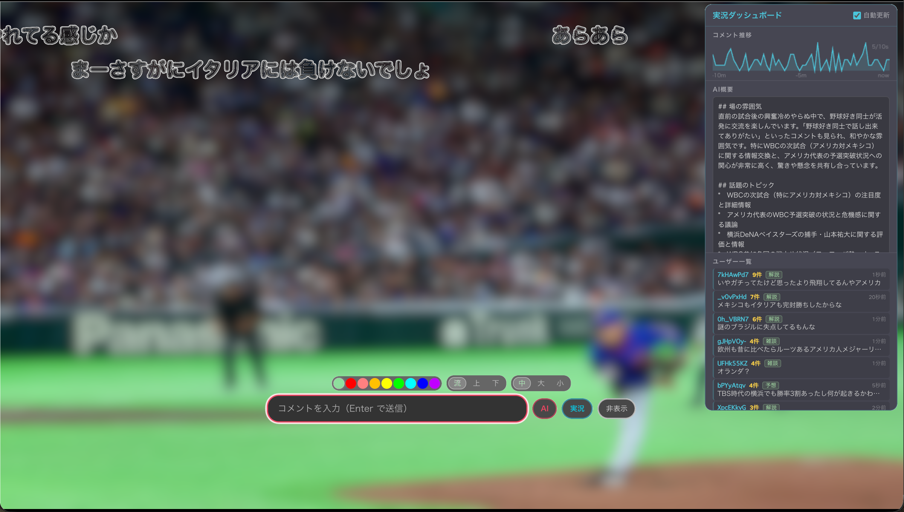

# Niko Jikkyo

Netflix の映像上にニコニコ生放送の実況コメントをリアルタイムに流す Chrome 拡張機能です。

2026 WBC (World Baseball Classic) の Netflix 独占配信を、ニコニコ実況のコメントと一緒に楽しむために作られました。



## Features

- ニコニコ生放送のコメントをリアルタイムにストリーミング取得
- Netflix の映像上にニコニコ風のコメントオーバーレイを表示
- チャンネル ID / 番組 ID を指定して接続
- mpn (NDGR) API の protobuf をストリーミングデコード

## Install

Chrome Web Store には公開していません。手動でインストールしてください。

1. このリポジトリを clone または zip ダウンロード
2. Chrome で `chrome://extensions` を開く
3. 右上の「デベロッパーモード」を ON
4. 「パッケージ化されていない拡張機能を読み込む」をクリック
5. clone したフォルダを選択

## Usage

1. Netflix で WBC の試合を開く
2. ニコニコ生放送で対応する実況チャンネルの ID を確認（例: `ch2650071`）
3. 拡張機能のポップアップでチャンネル ID を入力して「接続」
4. Netflix の映像上にコメントが流れます

**注意**: ニコニコ生放送へのログインは不要です。

## Tech Stack

- Chrome Extension Manifest V3
- Offscreen Document API（WebSocket + HTTP ストリーミング維持）
- ニコニコ mpn (NDGR) API（protobuf over HTTP streaming）
- スキーマなし protobuf ワイヤフォーマットデコーダ（自前実装）

## Architecture

```
popup.html  ←→  background.js (Service Worker)
                      ↕
                offscreen.js (WebSocket + mpn polling)
                      ↕
                mpn segment streams (protobuf)
                      ↕
                background.js  →  content_script.js (Netflix overlay)
```

1. ニコニコ生放送ページから WebSocket URL を取得
2. WebSocket 接続で `messageServer.viewUri` を取得
3. viewUri をロングポーリング → セグメント URI をストリーミング受信
4. セグメントをストリーミング読み取り → コメントをリアルタイム表示

## License

MIT

## Disclaimer

- 本拡張機能はニコニコ動画/ニコニコ生放送の非公開 API を使用しています。API 仕様の変更により動作しなくなる可能性があります。
- 動画上にコメントを流す表示方式に関して、株式会社ドワンゴが特許（特許第4695583号等、2026年12月失効予定）を保有しています。本ソフトウェアの利用は自己責任でお願いします。
- Netflix および WBC (World Baseball Classic) の商標はそれぞれの権利者に帰属します。
